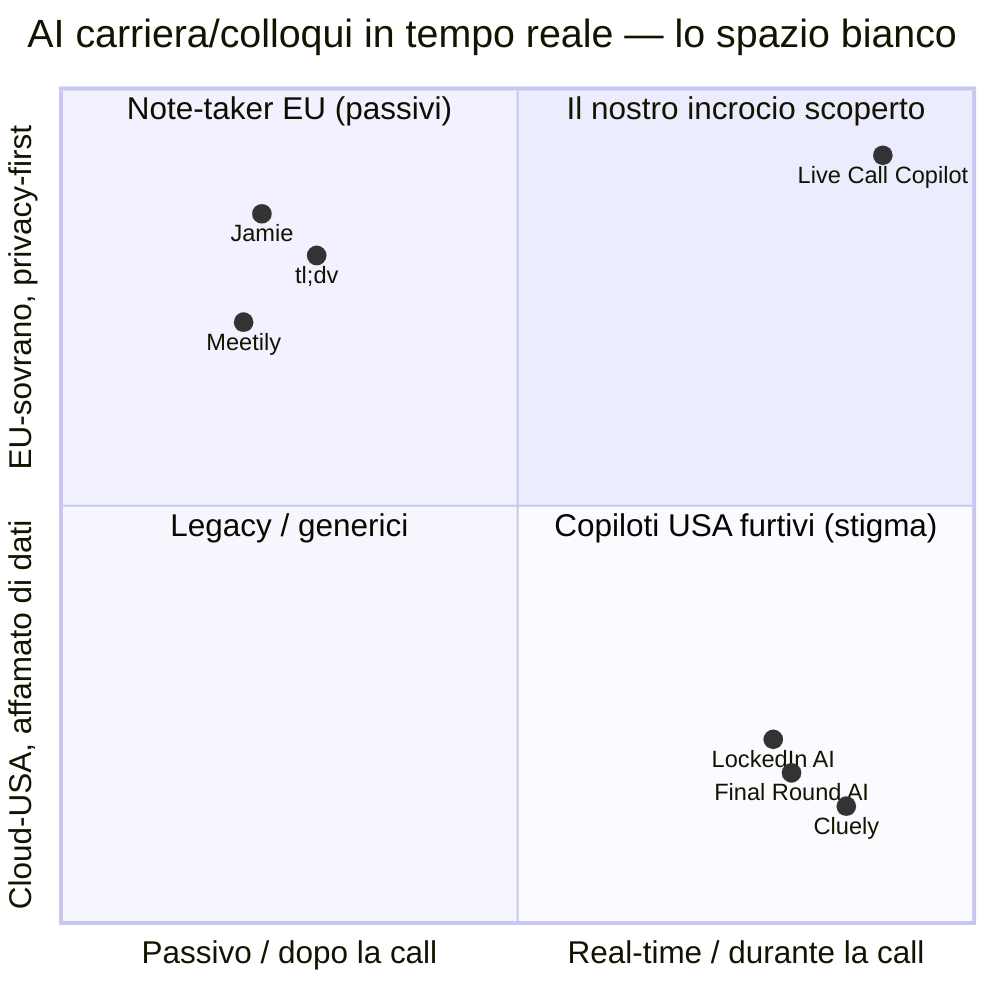
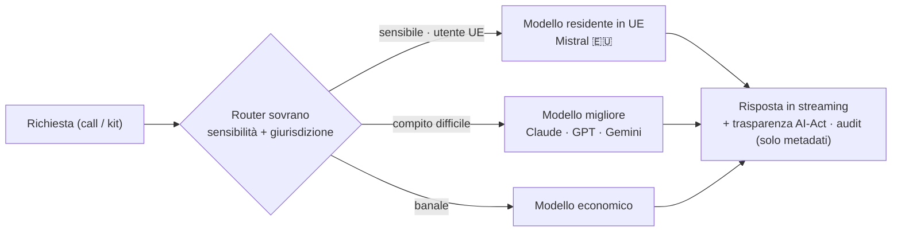
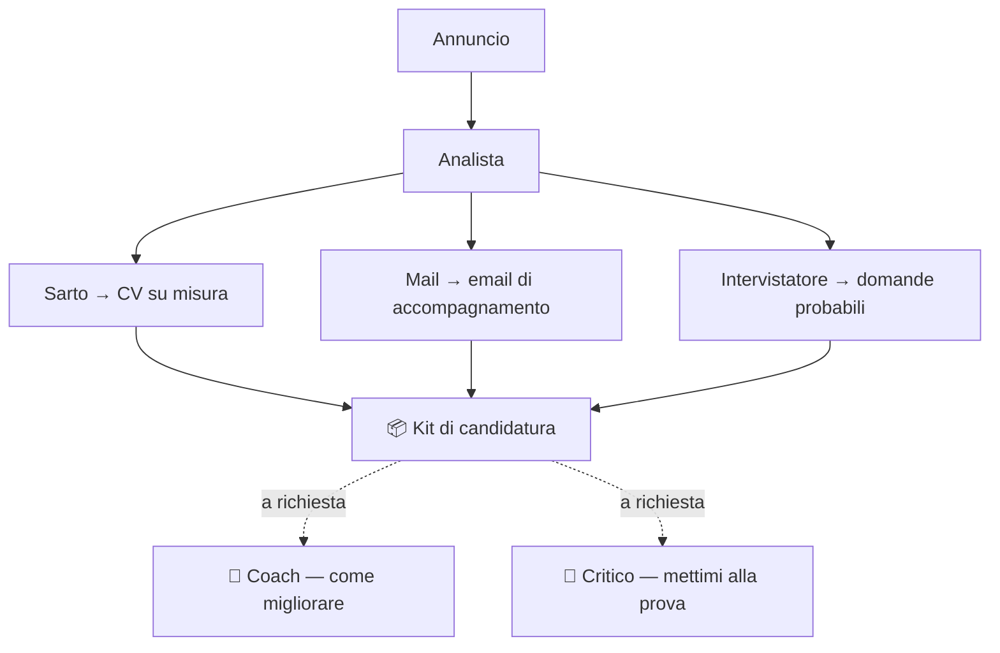
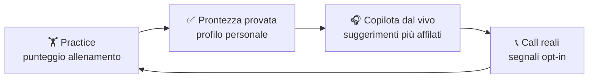
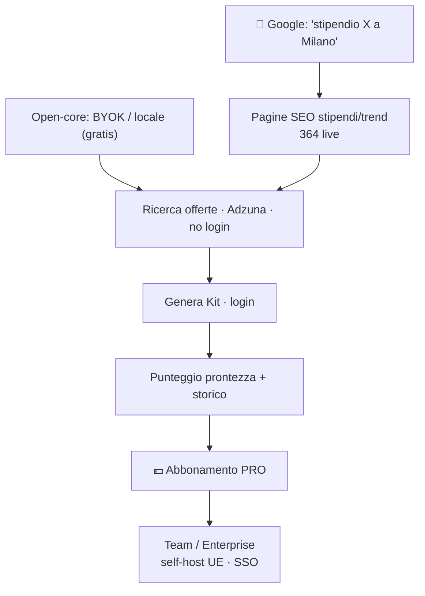

# 🎧 Live Call Copilot

**Il copilota di carriera sovrano e in tempo reale — con loop di prontezza provata.**

Privacy-first · Europeo 🇪🇺 · model-agnostic · GDPR-by-design

`🇬🇧 English version → ` [**README.md**](./README.md) · `📊 Strategia completa → ` [**STRATEGIA.md**](./STRATEGIA.md)

---

## Cos'è

Due pilastri, un backend, un dato:

- **🎙️ Copilota dal vivo** — un'app desktop cattura l'audio di sistema nelle call reali (Zoom/Meet/Teams), trascrive **on-device** (Whisper + VAD) e suggerisce cosa dire *mentre parli* — prima i colloqui, poi vendite / riunioni / assistenza.
- **🧩 Career OS** — trasforma un annuncio in un **kit di candidatura** su misura tramite un'orchestra di agenti (CV + mail + domande probabili, più Coach & Critico on-demand), con ricerca offerte reale (Adzuna), storico kit cifrato, **punteggio di prontezza provata** e pagine SEO pubbliche su stipendi/trend.

Ogni chiamata a un modello è instradata da un **router sovrano** — per *sensibilità + giurisdizione*, non solo costo/qualità. Il dato personale sensibile non esce mai dall'UE.

---

## 🗺️ Dove si colloca — la mappa

Due gruppi che non si parlano. Noi occupiamo l'angolo vuoto.

- **Copiloti USA furtivi** (Cluely, Final Round, LockedIn) competono sull'*invisibilità* — l'asse tossico per la reputazione. Cluely ha avuto un **data breach** e il CEO ha **ammesso di aver falsificato i ricavi** (mar 2026). Affamati di dati, cloud-USA, fiducia rotta.
- **Note-taker EU** (Jamie, tl;dv) sono privati ma **passivi** — riassumono *dopo*, non ti aiutano *durante*.
- **Noi siamo l'incrocio:** coaching in tempo reale **+** routing sovrano **+** cattura on-device **+** loop di allenamento.

---

## ⚙️ Architettura — il router sovrano

I lab dei foundation model **strutturalmente non possono** offrirlo: sono legati al proprio modello e il loro business *è* i tuoi dati sul loro cloud. La promessa *"i tuoi dati non toccano un lab USA"* non può costruirla un lab USA.

---

## 🧩 Il Kit — un'orchestra di agenti (4 + 2)

Ogni agente gira sulla catena sovrana (sensibile → modelli UE), fa streaming via SSE e mostra una plancia live con badge modello + bandiera 🇪🇺 + motivo di routing. L'output è effimero.

---

## 🔁 Il fossato è il loop

Nessuno impacchetta *allenati prima → copilota durante → debrief dopo*. Si autoalimenta e cresce con gli utenti.

Difendibilità vera = tutto ciò che un prompt **non** copia: cattura on-device · routing sovrano · flywheel della prontezza · compliance-come-prodotto · skill pack verticali curati · team/multiplayer.

---

## 📈 Funnel di crescita

**Valore reale gratis in cima, si paga per comodità / scala / prova.**

---

## ✅ Stato (live su infra UE — Scaleway, Parigi 🇫🇷)

| Area | Stato |
|---|---|
| Copilota dal vivo + cattura on-device | ✅ costruito |
| Routing sovrano (Mistral 🇪🇺 per il sensibile) | ✅ live |
| Orchestra Kit (4 agenti + Coach/Critico) | ✅ live |
| Ricerca offerte (Adzuna, dati reali) | ✅ live |
| Storico kit cifrato + punteggio prontezza | ✅ live |
| Pagine SEO stipendi/trend (364 URL) | ✅ live |
| DB di produzione separato + in sicurezza | ✅ fatto |
| Pipeline auto-deploy | ✅ permanente |
| Dominio custom → poi Search Console | 🔜 prossimo |
| Marketplace reverse recruiting | 🧭 Fase C (coi legali) |

---

## Perché ora

La domanda è provata (**~70%** dei job seeker usa l'AI per prepararsi; **38,5%** segnalati per AI-cheating nei colloqui dal vivo) e il leader è stato appena colto a mentire — uno sfidante **compliance-first, sovrano-UE, in frame coaching** cavalca due narrative vive per gli investitori (**career OS agentico** + **sovranità europea**, Mistral a **€20B** di valutazione) evitando la bandiera rossa post-Cluely del "tool per barare".

> *I foundation model sono il motore. Noi siamo l'automobile sovrana, verticale e in tempo reale che loro non hanno interesse a costruire — e che gli compra la benzina.*

**Analisi completa, fonti e pitch investitori → [STRATEGIA.md](./STRATEGIA.md)**

Fonti in linea in STRATEGIA.md · le cifre variano per scope dell'analista · la lettura AI-Act lato-candidato è una posizione ragionata, non legge consolidata.

