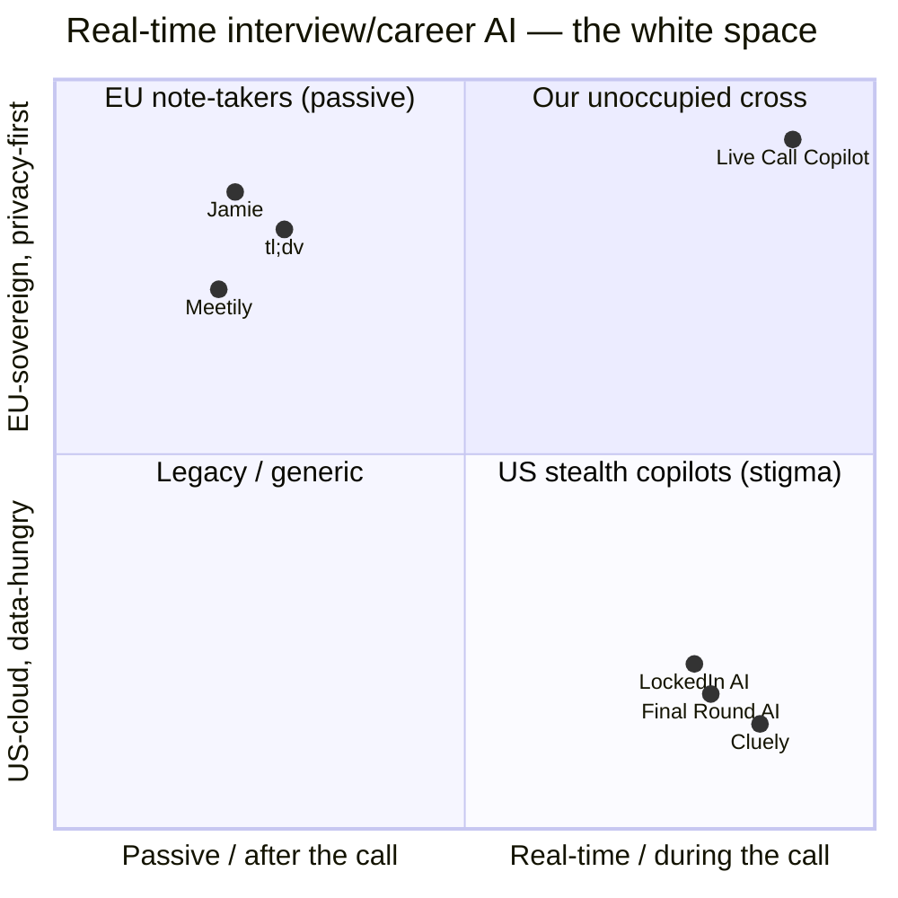
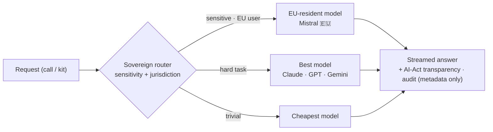
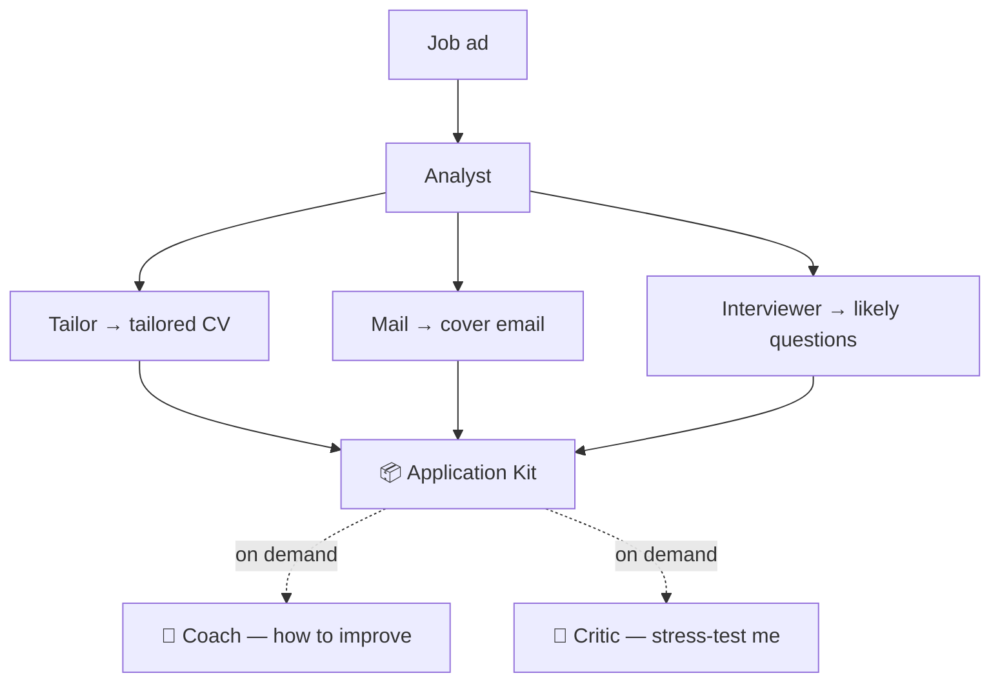
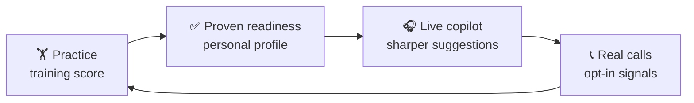
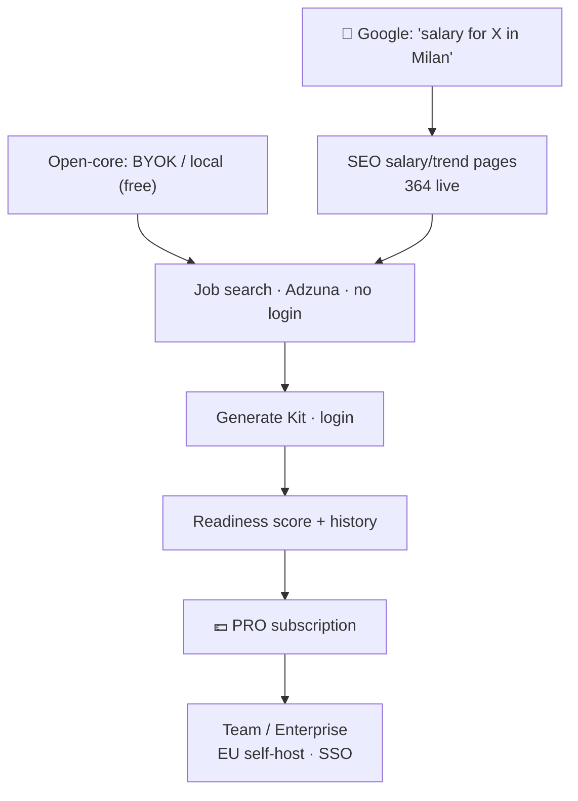

# 🎧 Live Call Copilot

**The sovereign, real-time career copilot — with a proven-readiness loop.**

Privacy-first · European 🇪🇺 · model-agnostic · GDPR-by-design

`🇮🇹 Versione italiana → ` [**README.it.md**](./README.it.md) · `📊 Full strategy → ` [**STRATEGY.md**](./STRATEGY.md)

---

## What it is

Two pillars, one backend, one dataset:

- **🎙️ Live copilot** — a desktop app captures system audio on real calls (Zoom/Meet/Teams), transcribes **on-device** (Whisper + VAD), and suggests what to say *while you speak* — interviews first, then sales / meetings / support.
- **🧩 Career OS** — turns a job ad into a tailored **application kit** via a multi-agent orchestra (CV + email + likely questions, plus on-demand Coach & Critic), with real job search (Adzuna), an encrypted kit history, a **proven-readiness score**, and public salary/trend SEO pages.

Every model call is routed by a **sovereign router** — by *sensitivity + jurisdiction*, not just cost/quality. Sensitive personal data never leaves the EU.

---

## 🗺️ Where it sits — the map

Two groups that don't talk to each other. We occupy the empty corner.

- **US stealth copilots** (Cluely, Final Round, LockedIn) compete on *undetectability* — the reputationally toxic axis. Cluely had a **data breach** and its CEO **admitted fabricating revenue** (Mar 2026). Data-hungry, US-cloud, trust-broken.
- **EU note-takers** (Jamie, tl;dv) are private but **passive** — they summarize *after*, they don't coach *during*.
- **We are the cross:** real-time coaching **+** sovereign routing **+** on-device capture **+** a training loop.

---

## ⚙️ Architecture — the sovereign router

Foundation labs **structurally cannot** offer this: they're bound to their own model and their business *is* your data on their cloud. A promise of *"your data never touches a US lab"* cannot be built by a US lab.

---

## 🧩 The Kit — a multi-agent orchestra (4 + 2)

Each agent runs on the sovereign chain (sensitive → EU models), streams over SSE, and shows a live board with model badge + 🇪🇺 flag + routing reason. Output is ephemeral.

---

## 🔁 The moat is the loop

Nobody packages *train before → copilot during → debrief after*. It feeds itself, and it compounds with users.

Real defensibility = everything a prompt **can't** copy: on-device capture · sovereign routing · the readiness flywheel · compliance-as-product · curated vertical skill packs · team/multiplayer.

---

## 📈 Growth funnel

**Give real value free at the top, charge for convenience / scale / proof.**

---

## ✅ Status (live on EU infra — Scaleway, Paris 🇫🇷)

| Area | State |
|---|---|
| Live copilot + on-device capture | ✅ built |
| Sovereign routing (Mistral 🇪🇺 for sensitive) | ✅ live |
| Kit orchestra (4 agents + Coach/Critic) | ✅ live |
| Job search (Adzuna, real data) | ✅ live |
| Encrypted kit history + readiness score | ✅ live |
| SEO salary/trend pages (364 URLs) | ✅ live |
| Production DB separated + secured | ✅ done |
| Auto-deploy pipeline | ✅ permanent |
| Custom domain → then Search Console | 🔜 next |
| Reverse-recruiting marketplace | 🧭 Phase C (with lawyers) |

---

## Why now

Demand is proven (**~70%** of job seekers use AI to prep; **38.5%** flagged for AI-cheating in live interviews) and the incumbent just got caught lying — a **compliance-forward, EU-sovereign, coaching-framed** challenger rides two live investor narratives (**agentic career OS** + **European sovereignty**, Mistral at a **€20B** valuation) while sidestepping the post-Cluely "cheating tool" red flag.

> *Foundation models are the engine. We're the sovereign, vertical, real-time car they have no incentive to build — and that buys their fuel.*

**Full analysis, sources, and the investor pitch → [STRATEGY.md](./STRATEGY.md)**

Sources are inline in STRATEGY.md · figures vary by analyst scope · candidate-side AI-Act reading is a reasoned position, not settled law.

